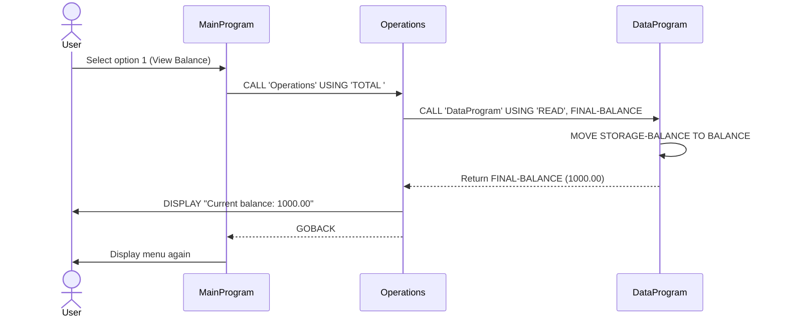
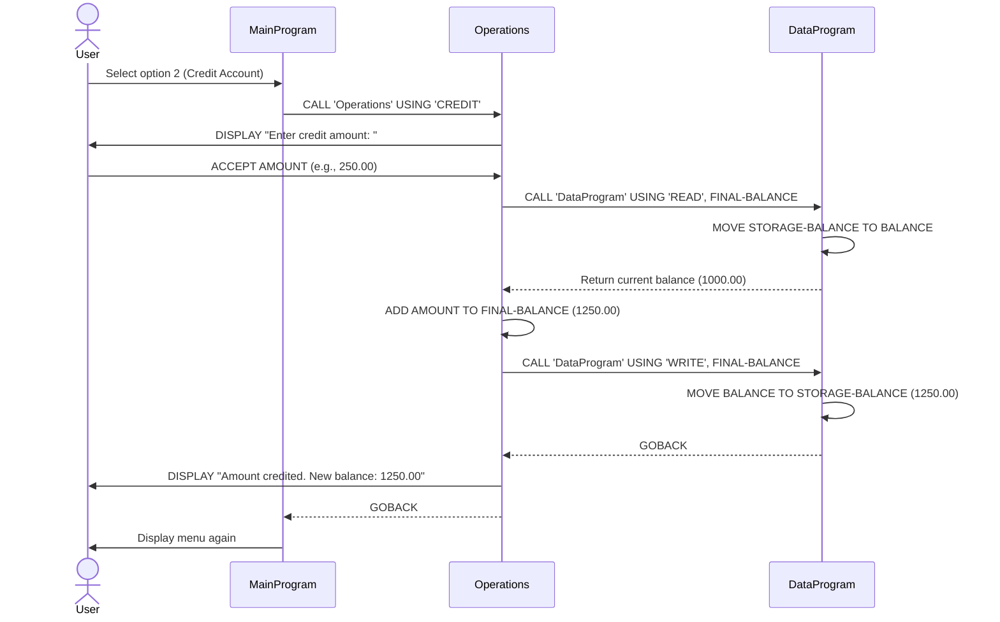
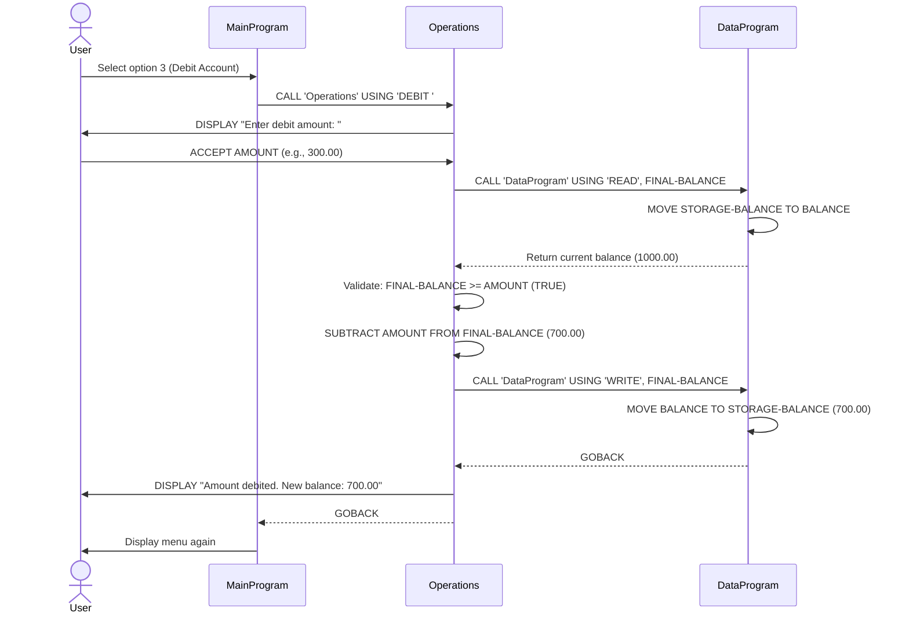
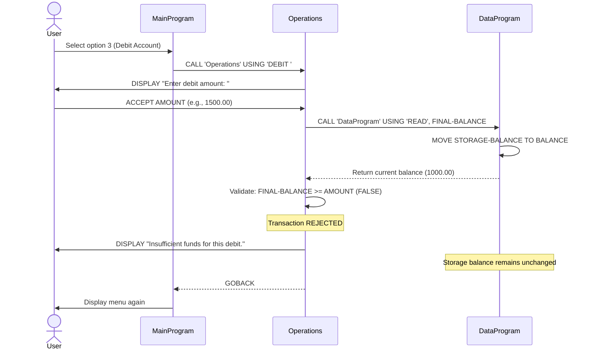
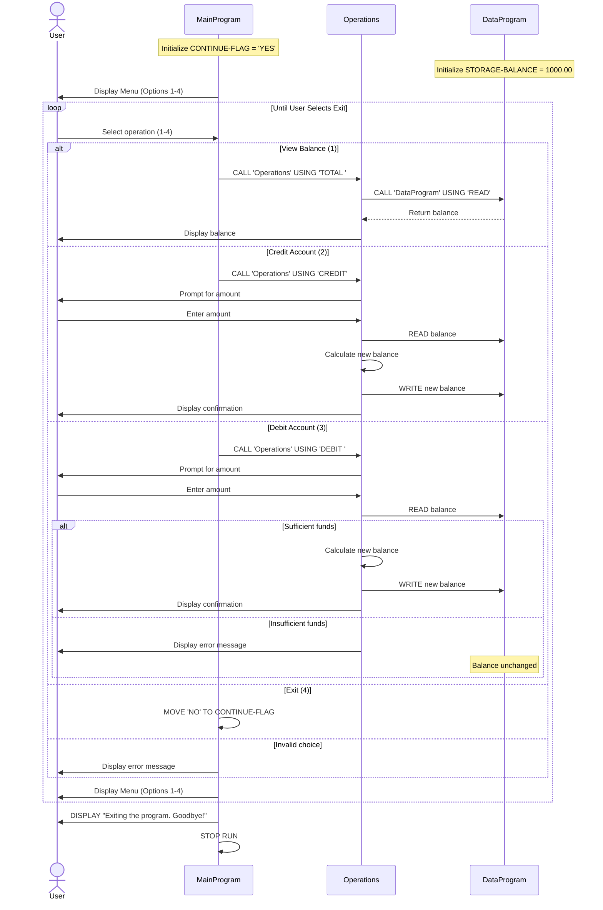

# COBOL Account Management System Documentation

## Overview

This system is a simple account management application written in COBOL that manages student account balances. The system follows a modular architecture with three interconnected programs that handle user interaction, business logic, and data storage.

## System Architecture

The application is structured in three layers:

1. **Presentation Layer** - `main.cob`
2. **Business Logic Layer** - `operations.cob`
3. **Data Access Layer** - `data.cob`

## COBOL Files

### 1. main.cob (MainProgram)

**Purpose:** Entry point and user interface for the account management system.

**Key Functions:**
- Displays a menu-driven interface with four options
- Accepts user input for operation selection
- Routes requests to the Operations program
- Manages the application's main execution loop

**Menu Options:**
1. View Balance - Displays current account balance
2. Credit Account - Add funds to the account
3. Debit Account - Withdraw funds from the account
4. Exit - Terminates the program

**Technical Details:**
- Uses `EVALUATE` statement for menu selection logic
- Implements a loop controlled by `CONTINUE-FLAG`
- Calls `Operations` program with operation type parameters
- Input validation for menu choices (1-4)

---

### 2. operations.cob (Operations)

**Purpose:** Business logic layer that processes account operations and enforces business rules.

**Key Functions:**

#### TOTAL Operation
- Retrieves current balance from data storage
- Displays balance to the user
- No balance modification

#### CREDIT Operation
- Accepts credit amount from user
- Reads current balance from storage
- Adds credit amount to balance
- Updates storage with new balance
- Displays new balance

#### DEBIT Operation
- Accepts debit amount from user
- Reads current balance from storage
- **Validates sufficient funds availability**
- If funds sufficient: subtracts amount and updates storage
- If funds insufficient: displays error message and aborts transaction
- Displays result (success or failure)

**Technical Details:**
- Receives operation type via `LINKAGE SECTION`
- Communicates with `DataProgram` for all storage operations
- Uses `CALL` statements to invoke data layer
- Format: `PIC 9(6)V99` allows balances up to $999,999.99

---

### 3. data.cob (DataProgram)

**Purpose:** Data access layer for persistent storage of account balance.

**Key Functions:**

#### READ Operation
- Returns current stored balance
- Non-destructive read operation
- Passes balance back to calling program via `LINKAGE SECTION`

#### WRITE Operation
- Updates stored balance with new value
- Receives new balance from calling program
- Overwrites `STORAGE-BALANCE`

**Technical Details:**
- Maintains `STORAGE-BALANCE` in `WORKING-STORAGE SECTION`
- Initial balance: $1,000.00
- Uses `LINKAGE SECTION` for parameter passing
- Simple interface: operation type ('READ', 'WRITE') and balance value

---

## Business Rules for Student Accounts

### 1. Initial Account Balance
- **Rule:** All new student accounts start with a balance of $1,000.00
- **Implementation:** Set in `STORAGE-BALANCE` in `data.cob`

### 2. Balance Constraints
- **Maximum Balance:** $999,999.99
- **Data Format:** 6 digits before decimal, 2 digits after (PIC 9(6)V99)
- **Minimum Balance:** No explicit minimum, but must be non-negative

### 3. Credit Operations
- **Rule:** Any positive amount can be credited to an account
- **Validation:** Amount must be numeric and within format constraints
- **Effect:** Balance increases by credit amount immediately

### 4. Debit Operations (Withdrawals)
- **Rule:** Debit is only permitted if sufficient funds are available
- **Validation:** Balance must be >= debit amount
- **Protection:** Prevents negative balances (overdraft protection)
- **Failure Handling:** Transaction is rejected with "Insufficient funds" message

### 5. Transaction Atomicity
- **Rule:** Each operation is atomic
- **Implementation:** 
  - READ current balance
  - Perform calculation
  - WRITE new balance
- **Note:** No rollback mechanism in current implementation

### 6. Balance Persistence
- **Rule:** Balance persists across operations within a program execution
- **Limitation:** Balance is stored in memory only; resets to $1,000.00 on program restart
- **Future Enhancement:** Consider implementing file-based or database persistence

---

## Program Flow

```
User Input → MainProgram → Operations → DataProgram
                ↓              ↓            ↓
           Menu Display   Business Logic  Data Storage
                ↓              ↓            ↓
           User Choice    Validation    Read/Write Balance
```

### Typical Transaction Flow

1. **View Balance:**
   - MainProgram calls Operations with 'TOTAL'
   - Operations calls DataProgram with 'READ'
   - DataProgram returns current balance
   - Operations displays balance

2. **Credit Account:**
   - MainProgram calls Operations with 'CREDIT'
   - Operations prompts for amount
   - Operations reads current balance
   - Operations adds amount to balance
   - Operations writes new balance
   - Operations displays confirmation

3. **Debit Account:**
   - MainProgram calls Operations with 'DEBIT'
   - Operations prompts for amount
   - Operations reads current balance
   - Operations validates sufficient funds
   - If valid: Operations subtracts amount and writes new balance
   - If invalid: Operations displays error
   - Operations displays result

---

## Data Definitions

### Balance Variables
- **Type:** Packed decimal (PIC 9(6)V99)
- **Range:** 0.00 to 999,999.99
- **Precision:** 2 decimal places
- **Currency:** Assumed to be USD

### Operation Types
- `'TOTAL '` - View balance (6 characters, space-padded)
- `'CREDIT'` - Add funds (6 characters)
- `'DEBIT '` - Withdraw funds (6 characters, space-padded)
- `'READ'` - Internal: read from storage (4 characters)
- `'WRITE'` - Internal: write to storage (5 characters)

---

## Known Limitations

1. **No Persistence:** Balance resets to $1,000.00 on program restart
2. **Single Account:** System manages only one account at a time
3. **No Transaction History:** No audit trail or transaction log
4. **No User Authentication:** No account identification or security
5. **No Concurrency Control:** Not designed for multi-user access
6. **Limited Error Handling:** Basic validation only
7. **No Interest Calculations:** No time-based balance adjustments
8. **No Account Limits:** No maximum transaction amount enforcement

---

## Future Enhancement Opportunities

1. Implement file-based or database persistence
2. Add multiple account support with account numbers
3. Create transaction history/audit log
4. Add user authentication and authorization
5. Implement interest calculation for student savings accounts
6. Add transaction limits and daily withdrawal caps
7. Create reporting functionality (statements, summaries)
8. Add error logging and recovery mechanisms
9. Implement concurrent access controls
10. Modernize to contemporary programming language (Python, Java, etc.)

---

## Technical Requirements

- COBOL compiler (GnuCOBOL/OpenCOBOL recommended)
- Programs must be compiled in correct order:
  1. `data.cob` (DataProgram)
  2. `operations.cob` (Operations)
  3. `main.cob` (MainProgram)

## Running the Application

```bash
# Compile programs
cobc -x -o main main.cob operations.cob data.cob

# Run the application
./main
```

---

## Application Data Flow - Sequence Diagram

The following sequence diagrams illustrate the complete data flow through the application for each operation type.

### View Balance Operation



### Credit Account Operation



### Debit Account Operation (Sufficient Funds)



### Debit Account Operation (Insufficient Funds)



### Complete Application Flow



---

*Last Updated: February 9, 2026*
